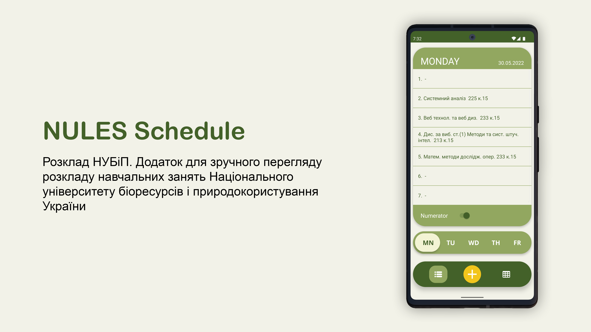
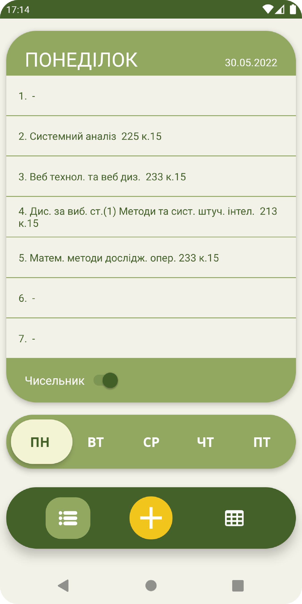
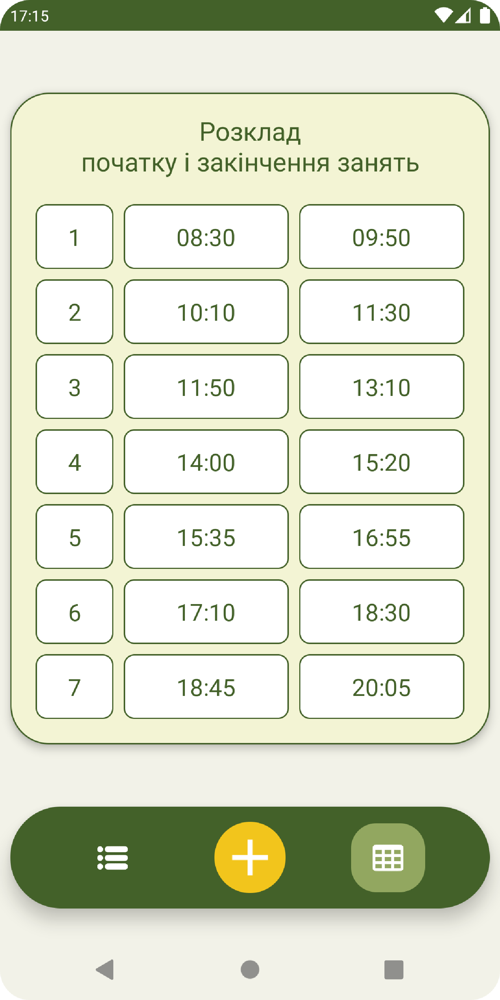
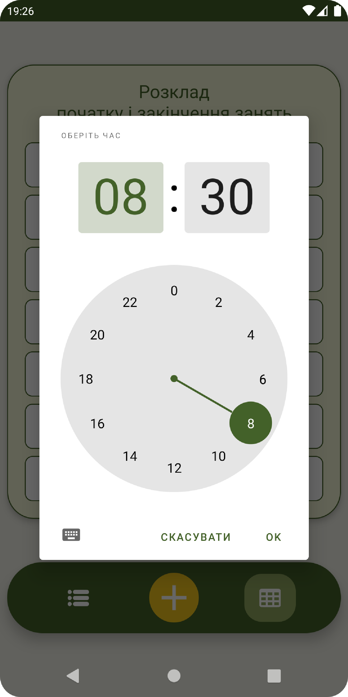
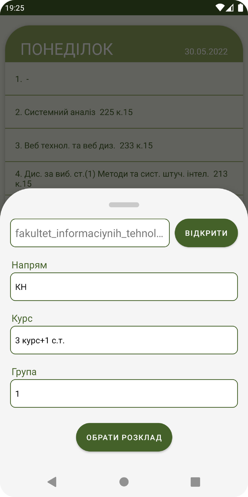

# Schedule
Schedule app for my University. Created to fix the issue of constantly searching for schedule in gigant spreadsheet file. 
This app does the parsing of this file and displays the correct schedule. It's my first project in this field.

[](LICENSE)

## Features
- Reading and displaying a schedule of the selected group of students from the spreadsheet file 
- Showing and being able to edit time schedule for lessons

## Overview
### Schedule screen


### Time schedule screen



### Edit time in the schedule



### Open the spreadsheet file



## Technologies used to make an app
- Java
- Android SDK

## License
```  
MIT License

Copyright (c) 2022 bogdan801

Permission is hereby granted, free of charge, to any person obtaining a copy
of this software and associated documentation files (the "Software"), to deal
in the Software without restriction, including without limitation the rights
to use, copy, modify, merge, publish, distribute, sublicense, and/or sell
copies of the Software, and to permit persons to whom the Software is
furnished to do so, subject to the following conditions:

The above copyright notice and this permission notice shall be included in all
copies or substantial portions of the Software.

THE SOFTWARE IS PROVIDED "AS IS", WITHOUT WARRANTY OF ANY KIND, EXPRESS OR
IMPLIED, INCLUDING BUT NOT LIMITED TO THE WARRANTIES OF MERCHANTABILITY,
FITNESS FOR A PARTICULAR PURPOSE AND NONINFRINGEMENT. IN NO EVENT SHALL THE
AUTHORS OR COPYRIGHT HOLDERS BE LIABLE FOR ANY CLAIM, DAMAGES OR OTHER
LIABILITY, WHETHER IN AN ACTION OF CONTRACT, TORT OR OTHERWISE, ARISING FROM,
OUT OF OR IN CONNECTION WITH THE SOFTWARE OR THE USE OR OTHER DEALINGS IN THE
SOFTWARE.
```
